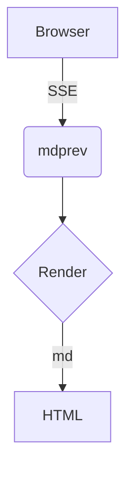

# Architecture

Some Rust code:

```rust
fn main() {
    println!("hello, {}", "world");
}
```

## Flow (mermaid)



## ASCII diagram

```bob
  +------+     +------+
  | box  +---->| box2 |
  +------+     +------+
```

Back to [home](README.md).

